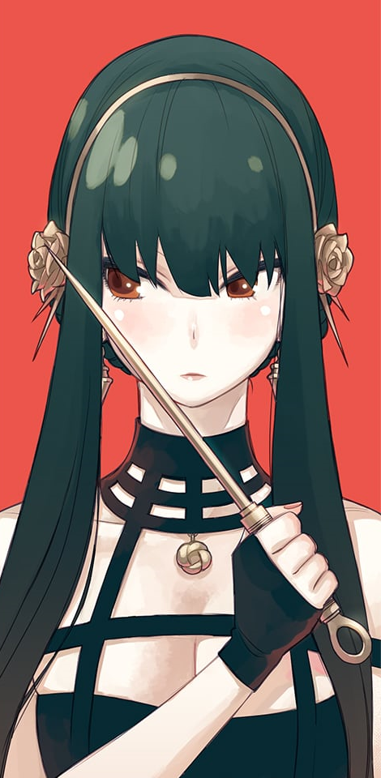

<html lang="en">

<head>
    <meta charset="UTF-8">
    <meta name="viewport" content="width=device-width, initial-scale=1.0">
    <title>Document</title>

    <link rel="stylesheet" href="css/estilo.css">
    <link rel="preconnect" href="https://fonts.googleapis.com">
<link rel="preconnect" href="https://fonts.gstatic.com" crossorigin>
<link href="https://fonts.googleapis.com/css2?family=Edu+VIC+WA+NT+Beginner:wght@400..700&family=Permanent+Marker&display=swap" rel="stylesheet">
</head>

<body>
    <main>
        <header>
            
        </header>
        <nav>
            <a href="#LF">Loid Forger</a>
            <a href="#YB">Yor Briar</a>
            <a href="#AF">Anya Forger</a>
            <a href="#BF">Bond Forger</a>
        </nav>
        <section>
            

                

                    
                

                

                    <h2 id="LF">Loid Forger</h2>
                    
Loid Forger, también conocido como Twilight, es el padre adoptivo de Anya y el esposo falso de
                        Yor. Él es un espía profesional que trabaja para el Reino de Westalis y que tiene la misión de
                        evitar una guerra con el Imperio de Ostania. Para ello, debe infiltrarse en la Academia Eden,
                        una prestigiosa escuela donde estudian los hijos de los políticos más influyentes del Imperio y
                        así dar con el jefe criminal llamado Donovan Desmond.

                

            

            

                

                    
                

                

                    <h2 id="YB">Yor Briar</h2>
                    
También conocida como Thorn Princess, es la madre adoptiva de Anya y la esposa falsa de Loid.
                        Ella es una asesina profesional que tiene la misión de eliminar a los enemigos del país. Para
                        ello, se hace pasar por una secretaria torpe y amable, que nadie sospecha que es una asesina.
                    

                

            

            

                

                    
                

                

                    <h2 id="AF">Anya Forger</h2>
                    
Es la hija adoptiva de Loid y Yor, siendo la protagonista principal del anime. Tan solo tiene
                        seis años, pero los poderes de telepatía de Anya forger hacen que sea uno de los personajes más
                        interesantes porque es capaz de saber lo que piensan y sienten los demás a su alrededor.
                    

                

            

            

                

                    
                

                

                    <h2 id="BF">Bond Forger</h2>
                    
El perro mascota de la familia Forger se ha convertido en un integrante esencial para el equipo.
                        Es muy especial porque tiene la habilidad de comunicarse telepáticamente con Anya. Bond suele
                        burlarse o criticar a Loid y Yor por sus acciones como espía y asesina, pero también los respeta
                        y los cuida como parte de su familia. Por otro lado, cuenta con la extraña habilidad de predecir
                        el futuro en ciertas ocasiones, ya que también fue un sujeto de experimento.

                

            

        </section>
        <footer></footer>
    </main>
</body>

</html>
